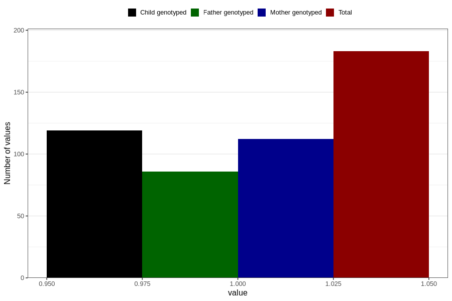

# joint_problems_yes_3y
Variable mapping to questionnaire: q6, question GG46.
- Number of values:

| Value | Total | Child genotyped | Mother genotyped | Father genotyped |
| ----- | ----- | --------------- | ---------------- | ---------------- |
| Missing | 113440 | 75312 | 71657 | 50132 |
| Non-missing | 183 | 119 | 112 | 86 |
| 1 | 183 | 119 | 112 | 86 |

