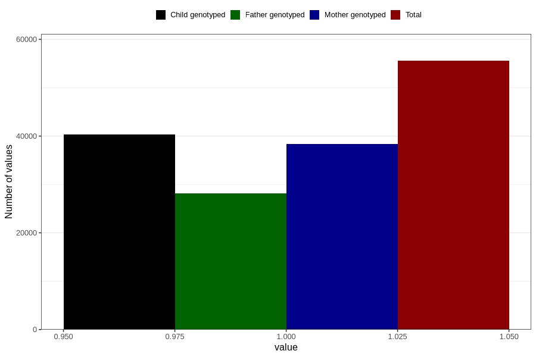

# late_or_abnormal_speech_development_no_3y
Variable mapping to questionnaire: q6, question GG93.
- Number of values:

| Value | Total | Child genotyped | Mother genotyped | Father genotyped |
| ----- | ----- | --------------- | ---------------- | ---------------- |
| Missing | 58073 | 35111 | 33439 | 22064 |
| Non-missing | 55550 | 40320 | 38330 | 28154 |
| 1 | 55550 | 40320 | 38330 | 28154 |

