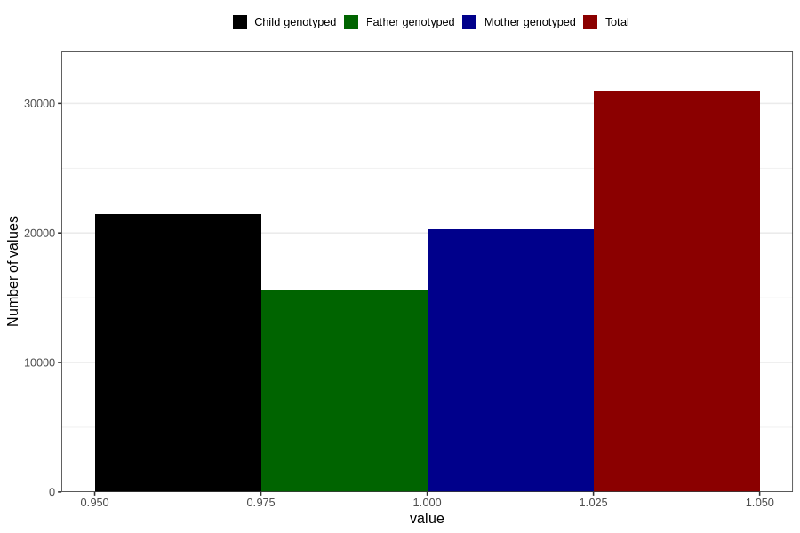

# no_syndrome_or_chromosomal_defect_6m
Variable mapping to questionnaire: q4, question DD1109.
- Number of values:

| Value | Total | Child genotyped | Mother genotyped | Father genotyped |
| ----- | ----- | --------------- | ---------------- | ---------------- |
| Missing | 82657 | 53991 | 51514 | 34638 |
| Non-missing | 30966 | 21440 | 20255 | 15580 |
| 1 | 30966 | 21440 | 20255 | 15580 |

