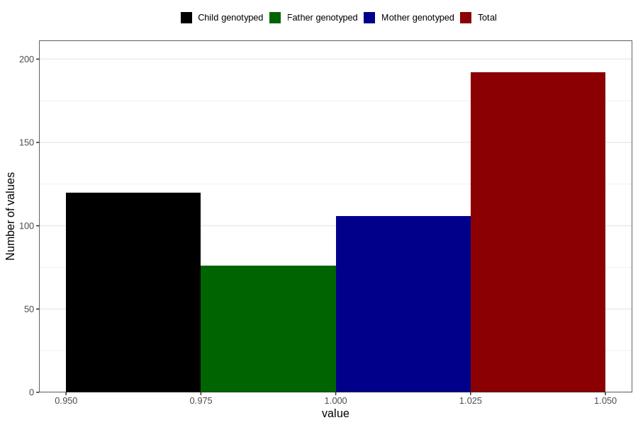

# other_behavioral_problems_yes_3y
Variable mapping to questionnaire: q6, question GG110.
- Number of values:

| Value | Total | Child genotyped | Mother genotyped | Father genotyped |
| ----- | ----- | --------------- | ---------------- | ---------------- |
| Missing | 113431 | 75311 | 71663 | 50142 |
| Non-missing | 192 | 120 | 106 | 76 |
| 1 | 192 | 120 | 106 | 76 |

