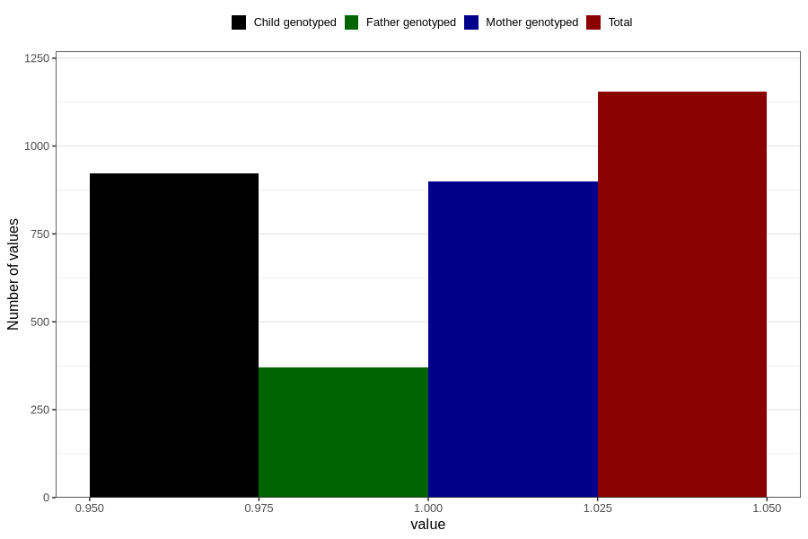

# other_gastrointestinal_problems_no_3y
Variable mapping to questionnaire: q6, question GG89.
- Number of values:

| Value | Total | Child genotyped | Mother genotyped | Father genotyped |
| ----- | ----- | --------------- | ---------------- | ---------------- |
| Missing | 112469 | 74508 | 70869 | 49847 |
| Non-missing | 1154 | 923 | 900 | 371 |
| 1 | 1154 | 923 | 900 | 371 |

