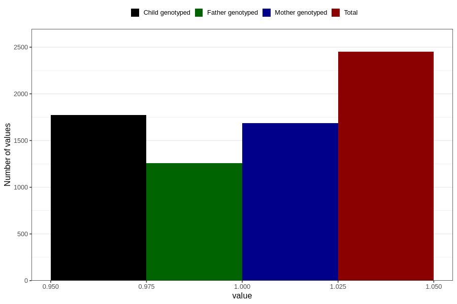

# other_previously_18m
Variable mapping to questionnaire: q5, question EE858.
- Number of values:

| Value | Total | Child genotyped | Mother genotyped | Father genotyped |
| ----- | ----- | --------------- | ---------------- | ---------------- |
| Missing | 111173 | 73656 | 70085 | 48960 |
| Non-missing | 2450 | 1775 | 1684 | 1258 |
| 1 | 2450 | 1775 | 1684 | 1258 |

