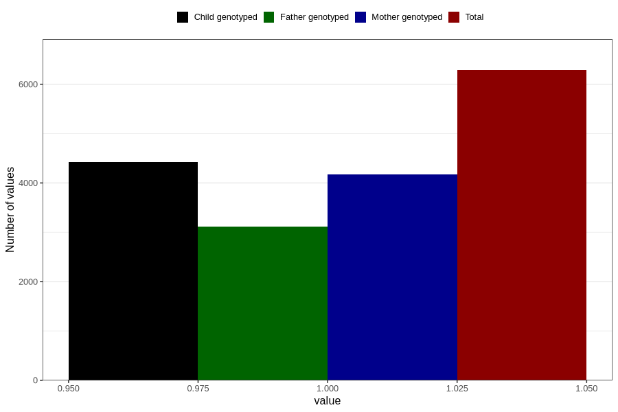

# specialist_diagnosis_1_18m
Variable mapping to questionnaire: q5, question EE861.
- Number of values:

| Value | Total | Child genotyped | Mother genotyped | Father genotyped |
| ----- | ----- | --------------- | ---------------- | ---------------- |
| Missing | 107339 | 71007 | 67595 | 47100 |
| Non-missing | 6284 | 4424 | 4174 | 3118 |
| 1 | 6284 | 4424 | 4174 | 3118 |

