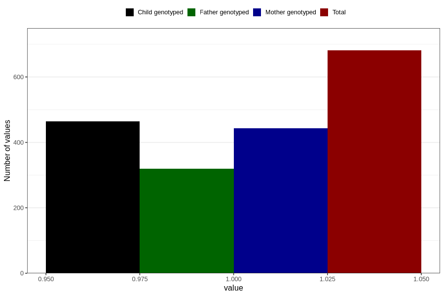

# testicles_not_descended_into_scrotum_previously_18m
Variable mapping to questionnaire: q5, question EE821.
- Number of values:

| Value | Total | Child genotyped | Mother genotyped | Father genotyped |
| ----- | ----- | --------------- | ---------------- | ---------------- |
| Missing | 112942 | 74967 | 71326 | 49898 |
| Non-missing | 681 | 464 | 443 | 320 |
| 1 | 681 | 464 | 443 | 320 |

