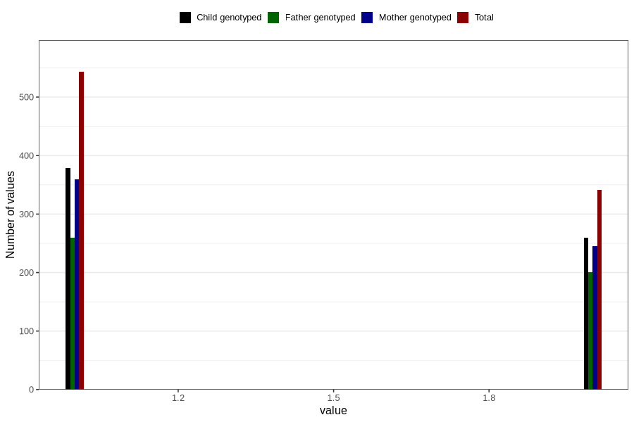

# fish_oil_capsules_amount_per_time_7y
Variable mapping to questionnaire: q8, question JJ536.
- Number of values:

| Value | Total | Child genotyped | Mother genotyped | Father genotyped |
| ----- | ----- | --------------- | ---------------- | ---------------- |
| Missing | 112726 | 74785 | 71158 | 49752 |
| Non-missing | 897 | 646 | 611 | 466 |
| 3+ at a time | 13 | 8 | 7 |6 |
| 1 | 543 | 379 | 359 | 259 |
| 2 | 341 | 259 | 245 | 201 |

