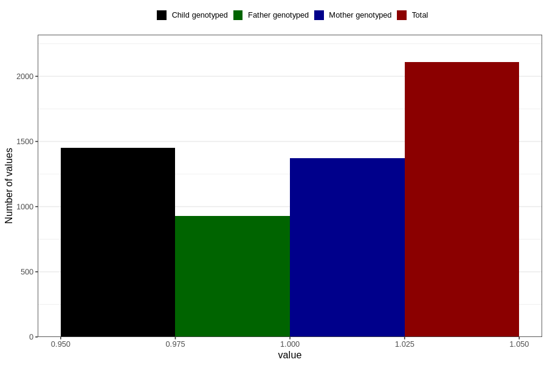

# formula_colett_omega3_1m
Variable mapping to questionnaire: q4, question DD64.
- Number of values:

| Value | Total | Child genotyped | Mother genotyped | Father genotyped |
| ----- | ----- | --------------- | ---------------- | ---------------- |
| Missing | 111515 | 73980 | 70398 | 49292 |
| Non-missing | 2108 | 1451 | 1371 | 926 |
| 1 | 2108 | 1451 | 1371 | 926 |

