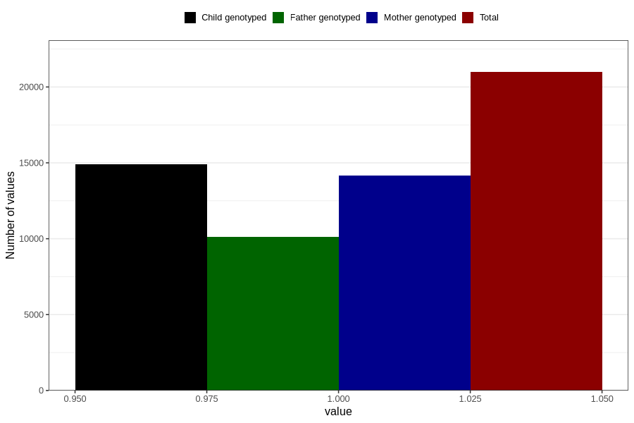

# formula_nan_5m
Variable mapping to questionnaire: q4, question DD75.
- Number of values:

| Value | Total | Child genotyped | Mother genotyped | Father genotyped |
| ----- | ----- | --------------- | ---------------- | ---------------- |
| Missing | 92644 | 60532 | 57588 | 40083 |
| Non-missing | 20979 | 14899 | 14181 | 10135 |
| 1 | 20979 | 14899 | 14181 | 10135 |

