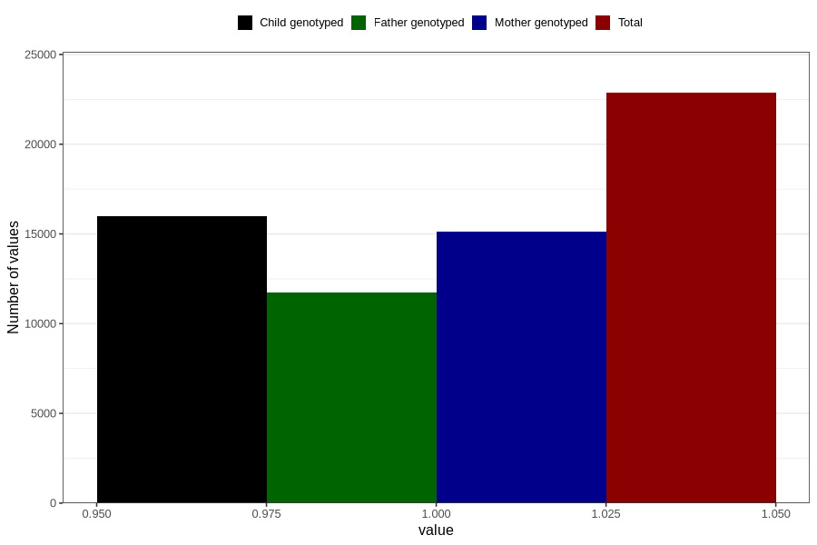

# omega3_liquid_5y
Variable mapping to questionnaire: q7, question LL472.
- Number of values:

| Value | Total | Child genotyped | Mother genotyped | Father genotyped |
| ----- | ----- | --------------- | ---------------- | ---------------- |
| Missing | 90764 | 59421 | 56626 | 38456 |
| Non-missing | 22859 | 16010 | 15143 | 11762 |
| 1 | 22859 | 16010 | 15143 | 11762 |

