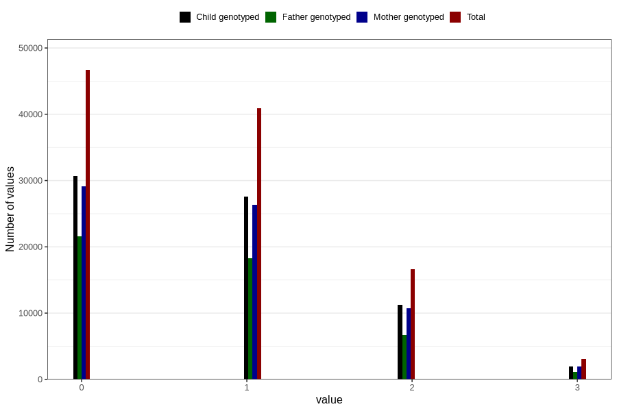

# n_previous_live_births
Variable mapping to questionnaire: mfr, question LEVENDEFODTE_5.
- Number of values:

| Value | Total | Child genotyped | Mother genotyped | Father genotyped |
| ----- | ----- | --------------- | ---------------- | ---------------- |
| Missing | 5400 | 3427 | 3264 | 2366 |
| Non-missing | 108223 | 72004 | 68505 | 47852 |
| 4 or more | 799 | 495 | 472 |225 |
| 0 | 46669 | 30673 | 29088 | 21551 |
| 1 | 40948 | 27628 | 26318 | 18302 |
| 2 | 16669 | 11222 | 10720 | 6699 |
| 3 | 3138 | 1986 | 1907 | 1075 |

