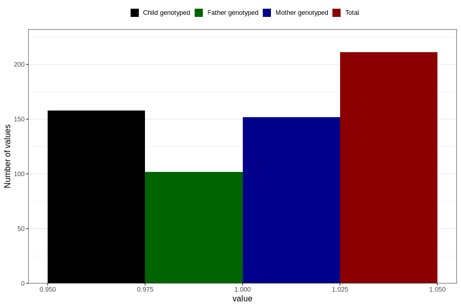

# endometriosis_during
Variable mapping to questionnaire: q1m, question AA690.
- Number of values:

| Value | Total | Child genotyped | Mother genotyped | Father genotyped |
| ----- | ----- | --------------- | ---------------- | ---------------- |
| Missing | 113412 | 75273 | 71617 | 50116 |
| Non-missing | 211 | 158 | 152 | 102 |
| 1 | 211 | 158 | 152 | 102 |

