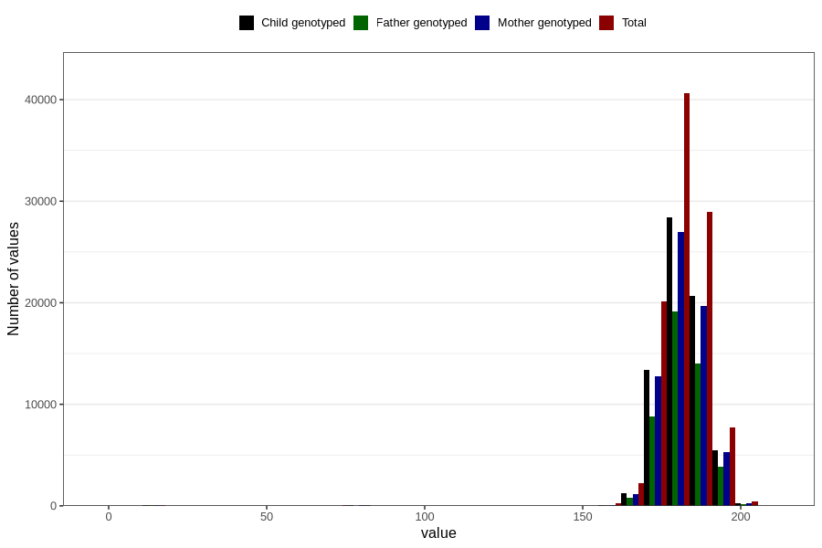

# father_height_15w
Variable mapping to questionnaire: q1m, question AA88.
- Number of values:

| Value | Total | Child genotyped | Mother genotyped | Father genotyped |
| ----- | ----- | --------------- | ---------------- | ---------------- |
| Missing | 13032 | 5654 | 5366 | 3227 |
| Non-missing | 100591 | 69777 | 66403 | 46991 |
| 25th percentile | 177 | 178 | 178 | 178 |
| 50th percentile | 181 | 182 | 182 | 182 |
| 75th percentile | 186 | 186 | 186 | 186 |

