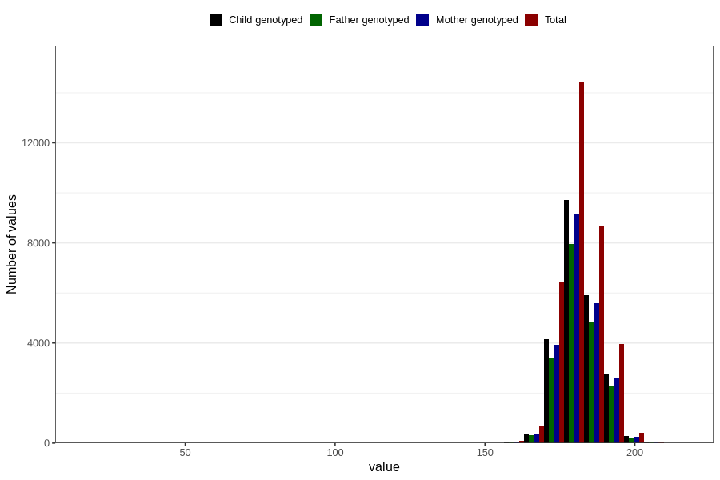

# father_height_self_15w
Variable mapping to questionnaire: q1f, question FF333.
- Number of values:

| Value | Total | Child genotyped | Mother genotyped | Father genotyped |
| ----- | ----- | --------------- | ---------------- | ---------------- |
| Missing | 78851 | 52153 | 49789 | 31195 |
| Non-missing | 34772 | 23278 | 21980 | 19023 |
| 25th percentile | 178 | 178 | 178 | 178 |
| 50th percentile | 182 | 182 | 182 | 182 |
| 75th percentile | 186 | 186 | 186 | 186 |

