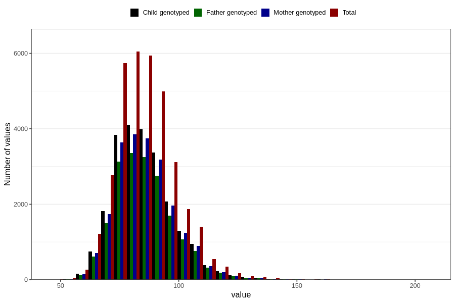

# father_weight_self_15w
Variable mapping to questionnaire: q1f, question FF334.
- Number of values:

| Value | Total | Child genotyped | Mother genotyped | Father genotyped |
| ----- | ----- | --------------- | ---------------- | ---------------- |
| Missing | 78894 | 52185 | 49819 | 31221 |
| Non-missing | 34729 | 23246 | 21950 | 18997 |
| 25th percentile | 77 | 77.025 | 77 | 77 |
| 50th percentile | 85 | 85 | 85 | 85 |
| 75th percentile | 93 | 93 | 93 | 93 |

