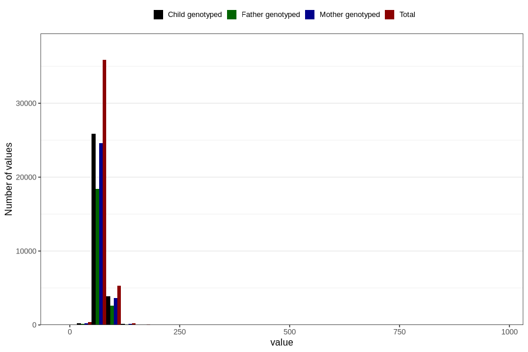

# mother_weight_8y
Variable mapping to questionnaire: q9, question NN284.
- Number of values:

| Value | Total | Child genotyped | Mother genotyped | Father genotyped |
| ----- | ----- | --------------- | ---------------- | ---------------- |
| Missing | 71744 | 45235 | 43151 | 28827 |
| Non-missing | 41879 | 30196 | 28618 | 21391 |
| 25th percentile | 61 | 61 | 61 | 61 |
| 50th percentile | 68 | 68 | 68 | 67.5 |
| 75th percentile | 76 | 76 | 76 | 75.3 |

