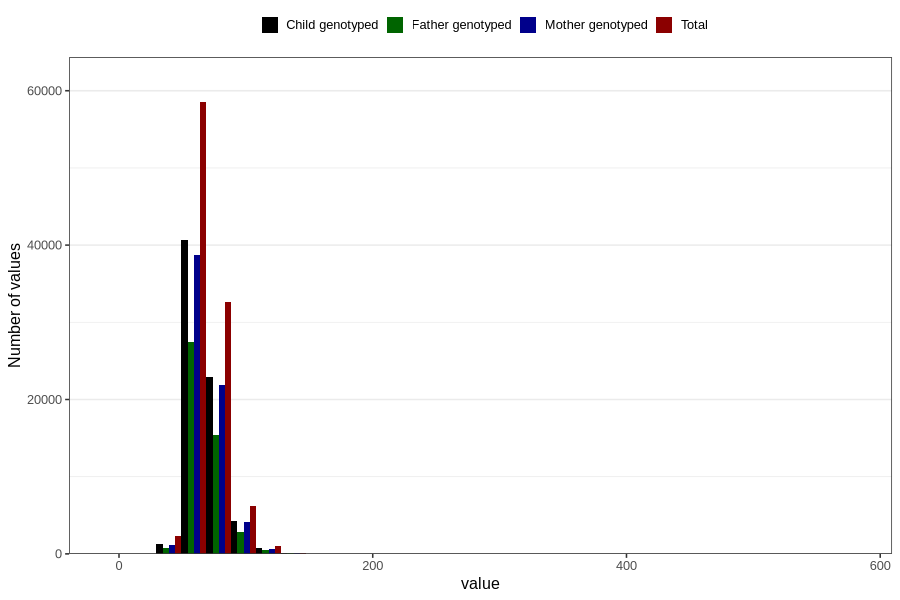

# mother_weight_beginning_self
Variable mapping to questionnaire: q1m, question AA85.
- Number of values:

| Value | Total | Child genotyped | Mother genotyped | Father genotyped |
| ----- | ----- | --------------- | ---------------- | ---------------- |
| Missing | 12833 | 5545 | 5265 | 3237 |
| Non-missing | 100790 | 69886 | 66504 | 46981 |
| 25th percentile | 59 | 60 | 60 | 60 |
| 50th percentile | 65 | 66 | 66 | 66 |
| 75th percentile | 74 | 74 | 74 | 74 |

