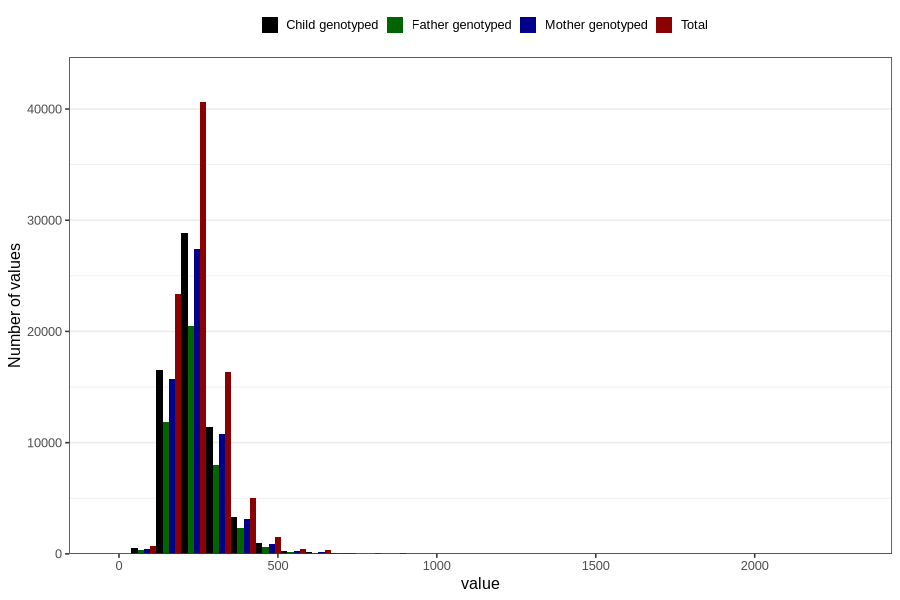

# cholesterol_mg
Variable mapping to questionnaire: q2_cwd_calculations, question KOLESTEROL.
- Number of values:

| Value | Total | Child genotyped | Mother genotyped | Father genotyped |
| ----- | ----- | --------------- | ---------------- | ---------------- |
| Missing | 24927 | 13198 | 12674 | 6238 |
| Non-missing | 88696 | 62233 | 59095 | 43980 |
| 25th percentile | 192.8475 | 192.61 | 192.54 | 192.14 |
| 50th percentile | 229.26 | 228.44 | 228.43 | 227.45 |
| 75th percentile | 279.9925 | 277.67 | 277.415 | 275.9525 |

