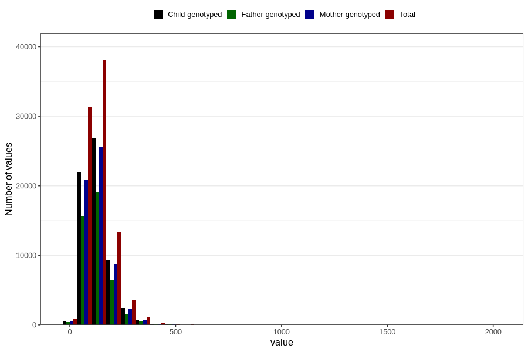

# food_iodine_mcg_day
Variable mapping to questionnaire: q2_fatty_acid_iodine, question f_jod.
- Number of values:

| Value | Total | Child genotyped | Mother genotyped | Father genotyped |
| ----- | ----- | --------------- | ---------------- | ---------------- |
| Missing | 24927 | 13198 | 12674 | 6238 |
| Non-missing | 88696 | 62233 | 59095 | 43980 |
| 25th percentile | 88.49625 | 88.7146 | 88.70385 | 88.387 |
| 50th percentile | 121.50405 | 121.4469 | 121.4574 | 120.6533 |
| 75th percentile | 162.451475 | 161.9163 | 161.6866 | 160.6884 |

