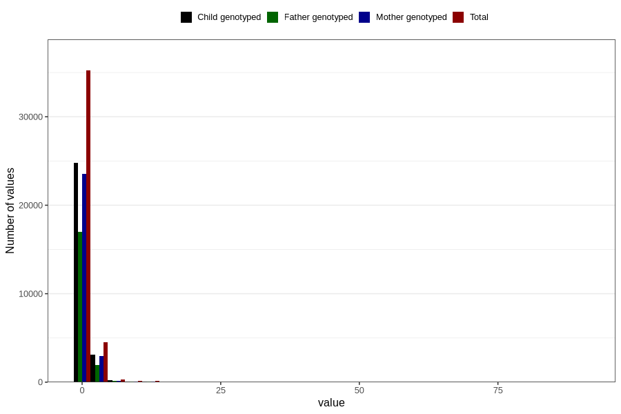

# soda_before
Variable mapping to questionnaire: q1m, question AA1395.
- Number of values:

| Value | Total | Child genotyped | Mother genotyped | Father genotyped |
| ----- | ----- | --------------- | ---------------- | ---------------- |
| Missing | 73318 | 47162 | 44869 | 31100 |
| Non-missing | 40305 | 28269 | 26900 | 19118 |
| Consumption have been reported by a mark but no amount given | 6 | 2 | 2 |1 |
| 25th percentile | 0 | 0 | 0 | 0 |
| 50th percentile | 0 | 0 | 0 | 0 |
| 75th percentile | 1 | 1 | 1 | 1 |

