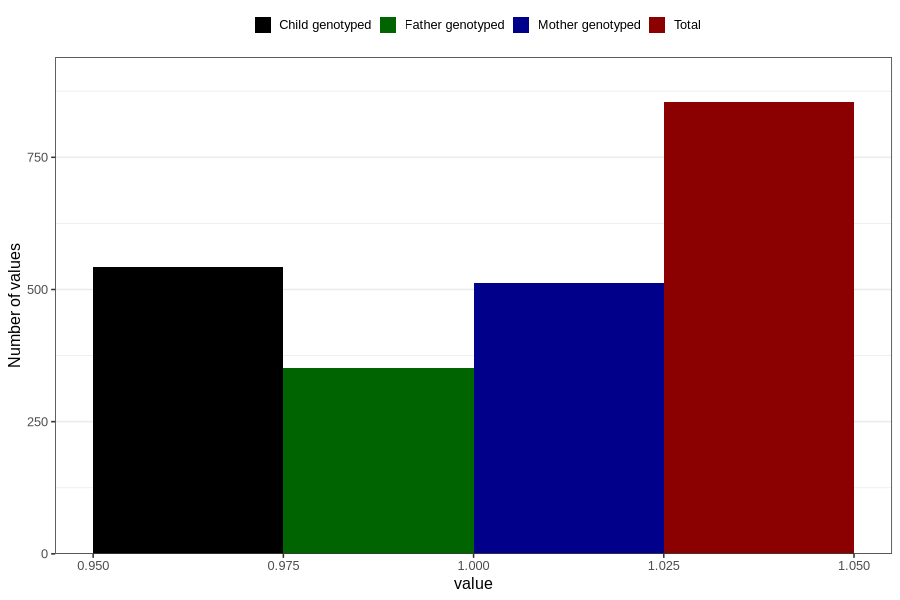

# hospitalized_bleeding
Variable mapping to questionnaire: q3, question CC146.
- Number of values:

| Value | Total | Child genotyped | Mother genotyped | Father genotyped |
| ----- | ----- | --------------- | ---------------- | ---------------- |
| Missing | 112769 | 74888 | 71257 | 49866 |
| Non-missing | 854 | 543 | 512 | 352 |
| 1 | 854 | 543 | 512 | 352 |

