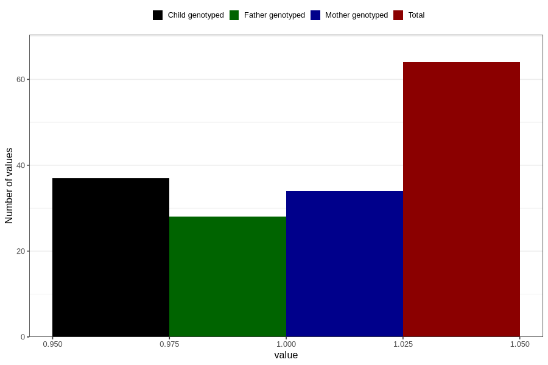

# hospitalized_bleeding_5_8w
Variable mapping to questionnaire: q3, question CC148.
- Number of values:

| Value | Total | Child genotyped | Mother genotyped | Father genotyped |
| ----- | ----- | --------------- | ---------------- | ---------------- |
| Missing | 113559 | 75394 | 71735 | 50190 |
| Non-missing | 64 | 37 | 34 | 28 |
| 1 | 64 | 37 | 34 | 28 |

