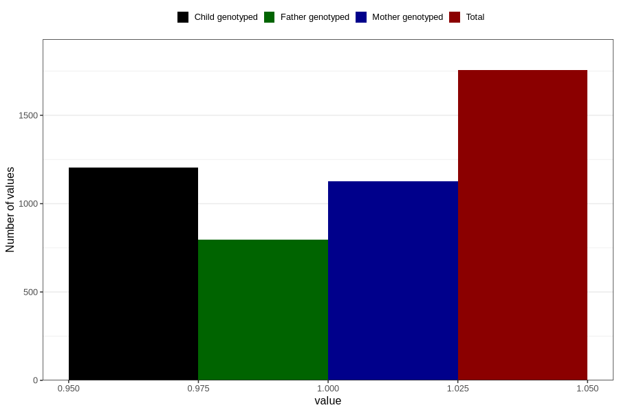

# influenza_9w_12w
Variable mapping to questionnaire: q1m, question AA378.
- Number of values:

| Value | Total | Child genotyped | Mother genotyped | Father genotyped |
| ----- | ----- | --------------- | ---------------- | ---------------- |
| Missing | 111868 | 74227 | 70643 | 49420 |
| Non-missing | 1755 | 1204 | 1126 | 798 |
| 1 | 1755 | 1204 | 1126 | 798 |

