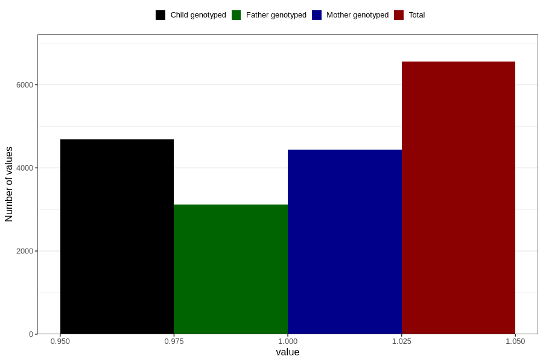

# contraception_used_mini_pill
Variable mapping to questionnaire: q1m, question AA33.
- Number of values:

| Value | Total | Child genotyped | Mother genotyped | Father genotyped |
| ----- | ----- | --------------- | ---------------- | ---------------- |
| Missing | 107070 | 70753 | 67337 | 47106 |
| Non-missing | 6553 | 4678 | 4432 | 3112 |
| 1 | 6553 | 4678 | 4432 | 3112 |

