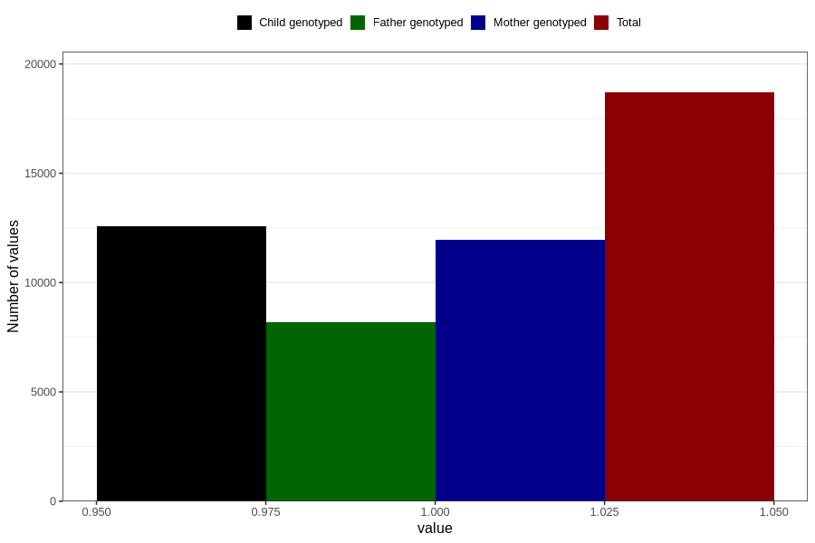

# contraception_used_no_such_method
Variable mapping to questionnaire: q1m, question AA38.
- Number of values:

| Value | Total | Child genotyped | Mother genotyped | Father genotyped |
| ----- | ----- | --------------- | ---------------- | ---------------- |
| Missing | 94932 | 62870 | 59824 | 42012 |
| Non-missing | 18691 | 12561 | 11945 | 8206 |
| 1 | 18691 | 12561 | 11945 | 8206 |

