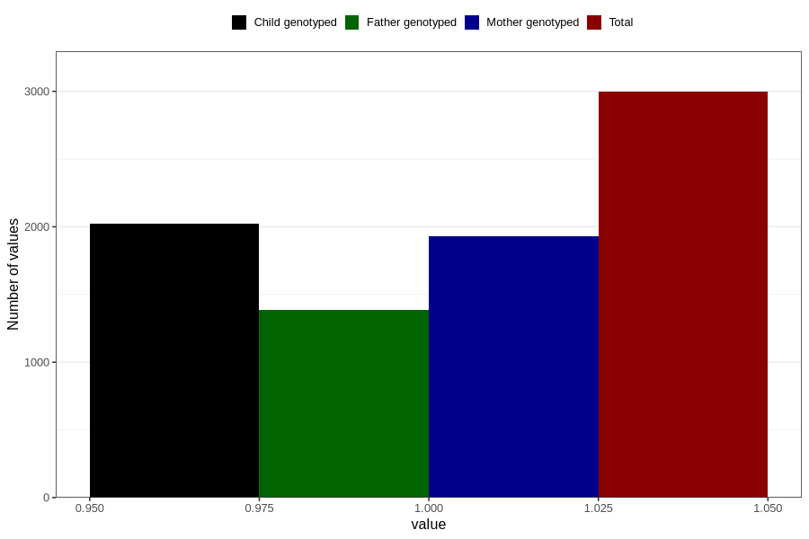

# treated_for_infertility_hormone_treatment
Variable mapping to questionnaire: q1m, question AA75.
- Number of values:

| Value | Total | Child genotyped | Mother genotyped | Father genotyped |
| ----- | ----- | --------------- | ---------------- | ---------------- |
| Missing | 110627 | 73409 | 69837 | 48834 |
| Non-missing | 2996 | 2022 | 1932 | 1384 |
| 1 | 2996 | 2022 | 1932 | 1384 |

