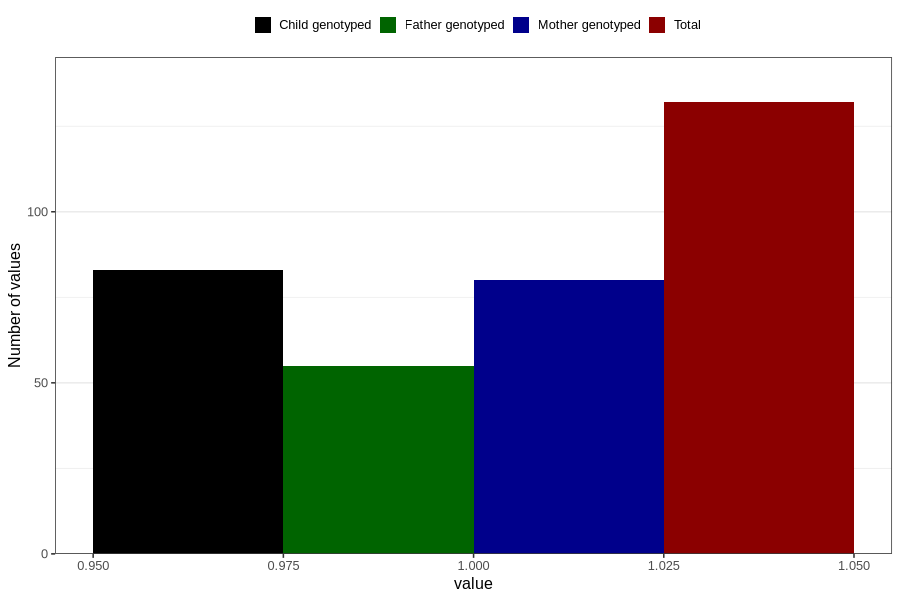

# treated_for_infertility_medication_endometriosis
Variable mapping to questionnaire: q1m, question AA73.
- Number of values:

| Value | Total | Child genotyped | Mother genotyped | Father genotyped |
| ----- | ----- | --------------- | ---------------- | ---------------- |
| Missing | 113491 | 75348 | 71689 | 50163 |
| Non-missing | 132 | 83 | 80 | 55 |
| 1 | 132 | 83 | 80 | 55 |

