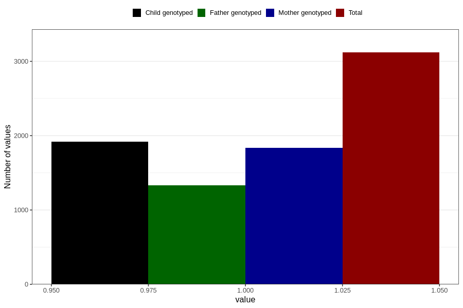

# treated_for_infertility_test_tube
Variable mapping to questionnaire: q1m, question AA79.
- Number of values:

| Value | Total | Child genotyped | Mother genotyped | Father genotyped |
| ----- | ----- | --------------- | ---------------- | ---------------- |
| Missing | 110504 | 73511 | 69936 | 48887 |
| Non-missing | 3119 | 1920 | 1833 | 1331 |
| 1 | 3119 | 1920 | 1833 | 1331 |

