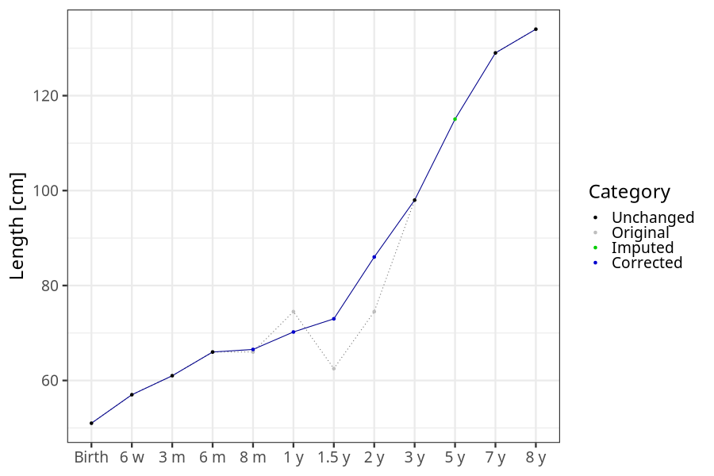
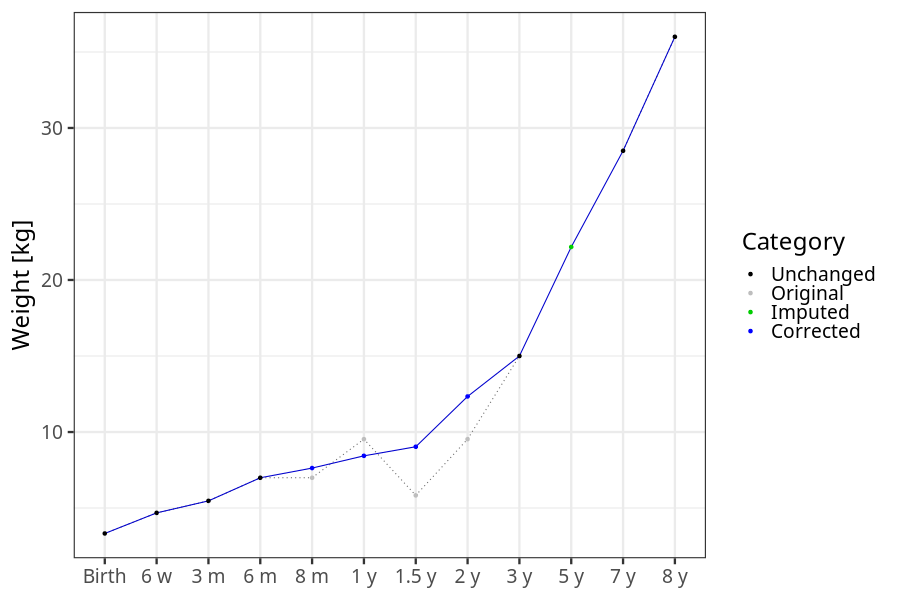
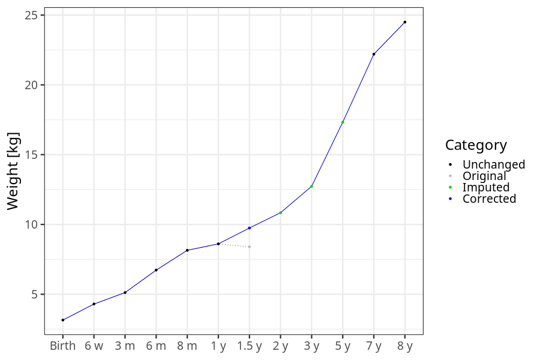

# Phenotypes
### Number of values

### Length vs weight

### Imputation
- Children with no data point altered: 68649
- Children with at least one data point altered: 44974
#### Random example: 47322
> imputed@length_16m imputed@length_2y imputed@weight_16m imputed@weight_2y

#### Random example: 97529
> imputed@length_16m imputed@length_2y imputed@weight_16m imputed@weight_2y

#### Random example: 74074
> imputed@length_16m imputed@length_2y imputed@weight_16m imputed@weight_2y

#### Random example: 63990
> imputed@length_16m imputed@length_2y imputed@weight_16m imputed@weight_2y

#### Random example: 7082
> imputed@length_16m imputed@length_2y imputed@weight_16m imputed@weight_2y

#### Random example: 20819
> imputed@length_16m imputed@length_2y imputed@weight_16m imputed@weight_2y

#### Random example: 32595
> imputed@length_16m imputed@length_2y imputed@weight_16m imputed@weight_2y

#### Random example: 66848
> imputed@length_16m imputed@length_2y imputed@weight_16m imputed@weight_2y

#### Random example: 109624
> imputed@length_16m imputed@length_2y imputed@weight_16m imputed@weight_2y

#### Random example: 93961
> imputed@length_16m imputed@length_2y imputed@weight_16m imputed@weight_2y

#### Random example: 4084
> imputed@length_16m imputed@length_2y imputed@weight_16m imputed@weight_2y

#### Random example: 20735
> imputed@length_16m imputed@length_2y imputed@weight_16m imputed@weight_2y

#### Random example: 78291
> imputed@length_16m imputed@length_2y imputed@weight_16m imputed@weight_2y

#### Random example: 111812
> imputed@length_16m imputed@length_2y imputed@weight_16m imputed@weight_2y

#### Random example: 98674
> imputed@length_16m imputed@length_2y imputed@weight_16m imputed@weight_2y

#### Random example: 200
> imputed@length_16m imputed@length_2y imputed@weight_16m imputed@weight_2y

#### Random example: 3280
> imputed@length_16m imputed@length_2y imputed@weight_16m imputed@weight_2y

#### Random example: 71540
> imputed@length_16m imputed@length_2y imputed@weight_16m imputed@weight_2y

#### Random example: 110052
> imputed@length_16m imputed@length_2y imputed@weight_16m imputed@weight_2y

#### Random example: 34166
> imputed@length_16m imputed@length_2y imputed@weight_16m imputed@weight_2y

#### Most extreme example (1): 58900
> 

#### Most extreme example (2): 5386
> 

#### Most extreme example (3): 92260
> imputed@length_16m imputed@length_2y imputed@weight_16m imputed@weight_2y

#### Most extreme example (4): 58490
> imputed@length_16m imputed@length_2y imputed@weight_16m imputed@weight_2y

#### Most extreme example (5): 32548
> 

#### Most extreme example (6): 93427
> imputed@length_8m imputed@length_1y imputed@length_16m imputed@weight_8m imputed@weight_1y imputed@weight_16m

#### Most extreme example (7): 6804
> outlier@length_2y imputed@length_2y

#### Most extreme example (8): 40048
> 

#### Most extreme example (9): 95175
> 

#### Most extreme example (10): 60926
> imputed@length_5y imputed@weight_5y

#### Most extreme example (11): 6934
> 

#### Most extreme example (12): 35212
> imputed@weight_6m imputed@weight_8m imputed@weight_16m

#### Most extreme example (13): 59745
> imputed@length_16m imputed@length_2y imputed@weight_16m imputed@weight_2y

#### Most extreme example (14): 45149
> 

#### Most extreme example (15): 132
> 

#### Most extreme example (16): 85162
> outlier@weight_1y imputed@weight_1y imputed@weight_2y

#### Most extreme example (17): 92584
> 

#### Most extreme example (18): 82565
> 

#### Most extreme example (19): 58515
> imputed@length_16m imputed@length_2y imputed@weight_16m imputed@weight_2y

#### Most extreme example (20): 48352
> 

