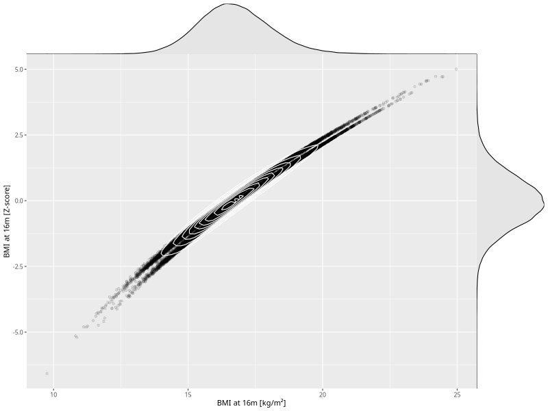

## BMI at 16m

| Name | # Children | # Mothers | # Fathers | # Total |
| ---- | ---------- | --------- | --------- | ------- |
| bmi_16m | 41024 | 38977 | 28713 | 108714 |
| z_bmi_16m | 41024 | 38977 | 28713 | 108714 |

- Formula: `bmi_16m ~ fp(pregnancy_duration_1)`
- Sigma formula: ` ~ pregnancy_duration_1`
- Distribution: `LOGNO`
- Normalization: `centiles.pred` Z-scores

