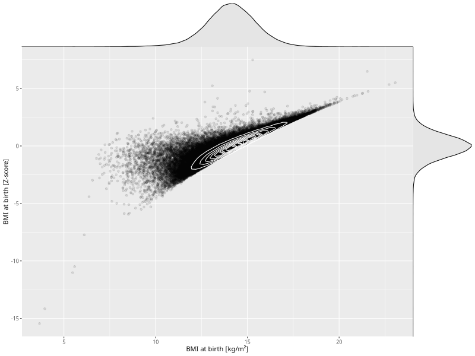

## BMI at birth

| Name | # Children | # Mothers | # Fathers | # Total |
| ---- | ---------- | --------- | --------- | ------- |
| bmi_birth | 72642 | 69115 | 48301 | 190058 |
| z_bmi_birth | 72642 | 69115 | 48301 | 190058 |

- Formula: `bmi_birth ~ fp(pregnancy_duration_1)`
- Sigma formula: ` ~ pregnancy_duration_1`
- Distribution: `LOGNO`
- Normalization: `centiles.pred` Z-scores

