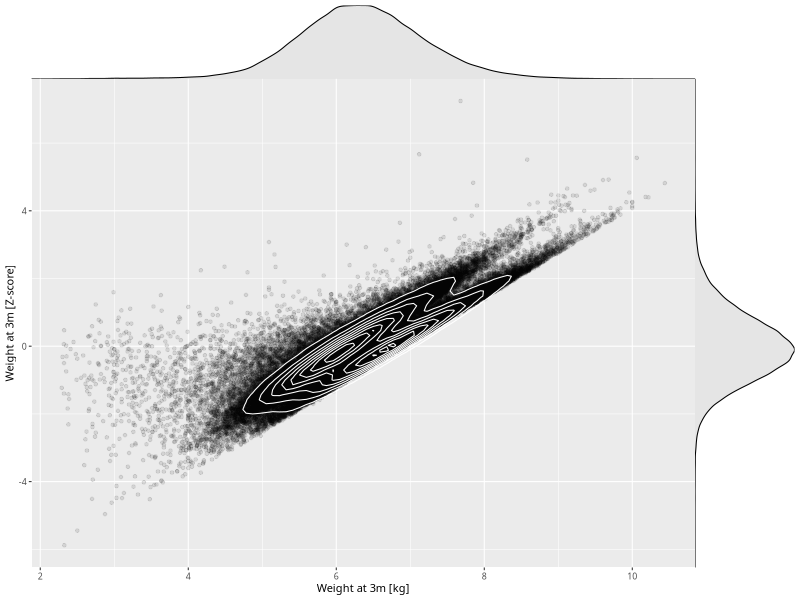

## Weight at 3m

| Name | # Children | # Mothers | # Fathers | # Total |
| ---- | ---------- | --------- | --------- | ------- |
| weight_3m | 62651 | 59662 | 42214 | 164527 |
| z_weight_3m | 62651 | 59662 | 42214 | 164527 |

- Formula: `weight_3m ~ fp(pregnancy_duration_1)`
- Sigma formula: ` ~ pregnancy_duration_1`
- Distribution: `NO`
- Normalization: `centiles.pred` Z-scores

