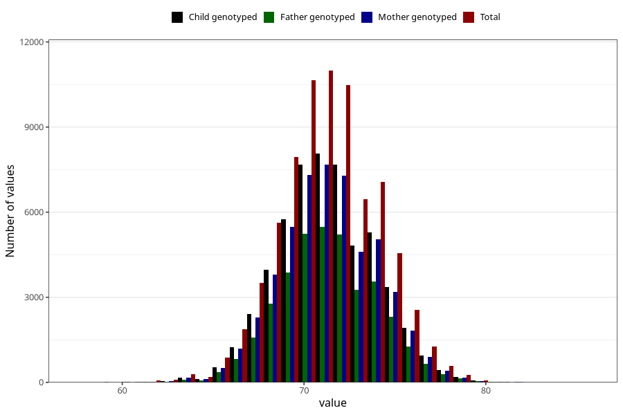

# length_8m
Variable mapping to questionnaire: q5, question EE387.
- Number of values:

| Value | Total | Child genotyped | Mother genotyped | Father genotyped |
| ----- | ----- | --------------- | ---------------- | ---------------- |
| Missing | 38060 | 20663 | 19625 | 13105 |
| Non-missing | 75563 | 54768 | 52144 | 37113 |
| 25th percentile | 69.5 | 69.5 | 69.5 | 69.5 |
| 50th percentile | 71 | 71.3 | 71.3 | 71.3314534670037 |
| 75th percentile | 73 | 73 | 73 | 73 |

