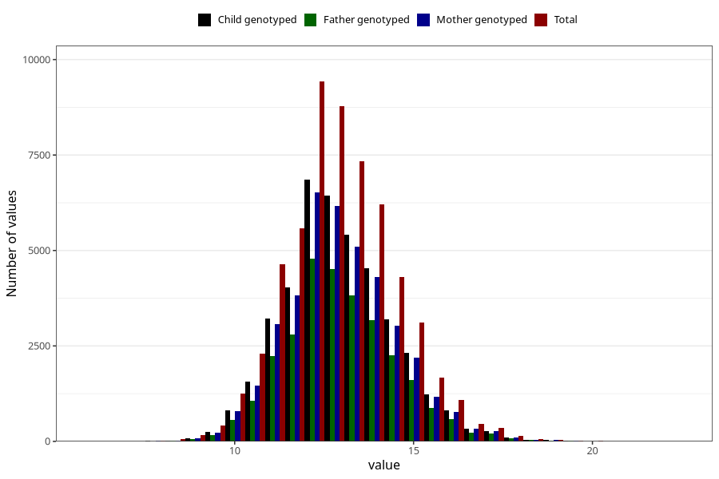

# weight_2y
Variable mapping to questionnaire: q6, question GG21.
- Number of values:

| Value | Total | Child genotyped | Mother genotyped | Father genotyped |
| ----- | ----- | --------------- | ---------------- | ---------------- |
| Missing | 56186 | 33798 | 32215 | 21105 |
| Non-missing | 57437 | 41633 | 39554 | 29113 |
| 25th percentile | 11.95 | 12 | 12 | 12 |
| 50th percentile | 12.9 | 12.9427672507673 | 12.94 | 12.9582244091965 |
| 75th percentile | 13.9597180315123 | 14 | 14 | 14 |

