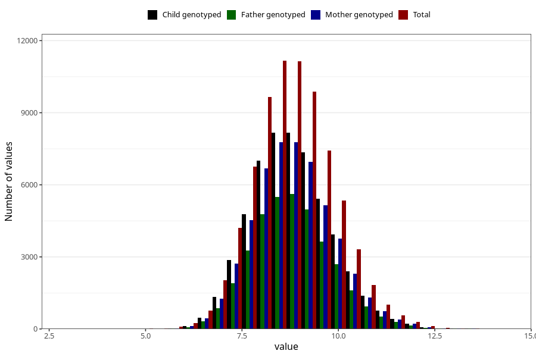

# weight_8m
Variable mapping to questionnaire: q5, question EE386.
- Number of values:

| Value | Total | Child genotyped | Mother genotyped | Father genotyped |
| ----- | ----- | --------------- | ---------------- | ---------------- |
| Missing | 37636 | 20420 | 19388 | 12951 |
| Non-missing | 75987 | 55011 | 52381 | 37267 |
| 25th percentile | 8.09 | 8.12121703495697 | 8.12 | 8.13 |
| 50th percentile | 8.76 | 8.78 | 8.78 | 8.78 |
| 75th percentile | 9.47 | 9.48626112319623 | 9.49 | 9.485 |

