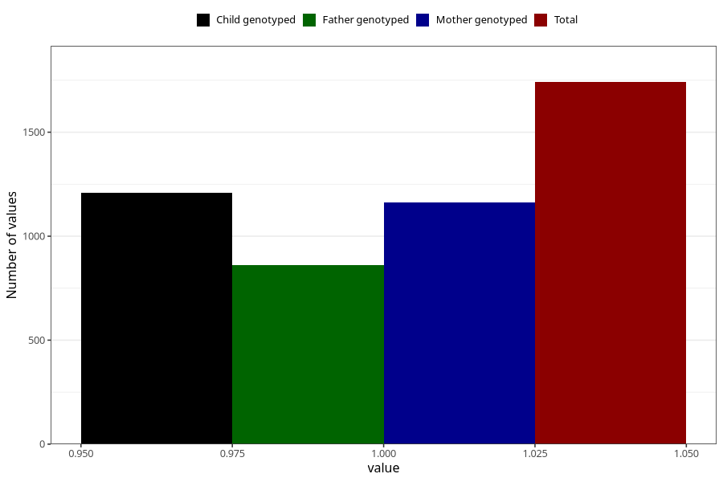

# abnormal_head_circumference_previously_18m
Variable mapping to questionnaire: q5, question EE813.
- Number of values:

| Value | Total | Child genotyped | Mother genotyped | Father genotyped |
| ----- | ----- | --------------- | ---------------- | ---------------- |
| Missing | 111882 | 74221 | 70608 | 49358 |
| Non-missing | 1741 | 1210 | 1161 | 860 |
| 1 | 1741 | 1210 | 1161 | 860 |

