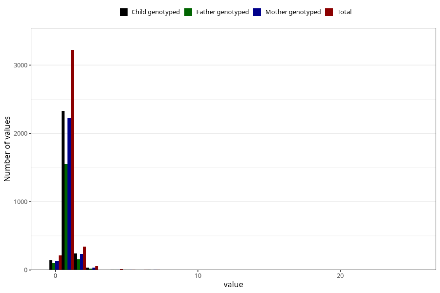

# accident_injury_number_12_18m
Variable mapping to questionnaire: q5, question EE268.
- Number of values:

| Value | Total | Child genotyped | Mother genotyped | Father genotyped |
| ----- | ----- | --------------- | ---------------- | ---------------- |
| Missing | 109741 | 72649 | 69113 | 48366 |
| Non-missing | 3882 | 2782 | 2656 | 1852 |
| 0 | 216 | 144 | 138 | 98 |
| 1 | 3223 | 2332 | 2221 | 1553 |
| 2 | 345 | 243 | 234 | 159 |
| 3 | 56 | 36 | 36 | 24 |
| 4 | 15 | 9 | 9 | 7 |
| 5 | 7 | 5 | 5 | 3 |
| 6 | 5 | 2 | 2 | 0 |
| 7 | 4 | 3 | 3 | 2 |
| 8 | 2 | 1 | 1 | 0 |
| 10 | 2 | 0 | 0 | 0 |
| 14 | 1 | 1 | 1 | 1 |
| 15 | 1 | 1 | 1 | 1 |
| 16 | 2 | 2 | 2 | 1 |
| 17 | 1 | 1 | 1 | 1 |
| 20 | 1 | 1 | 1 | 1 |
| 25 | 1 | 1 | 1 | 1 |

