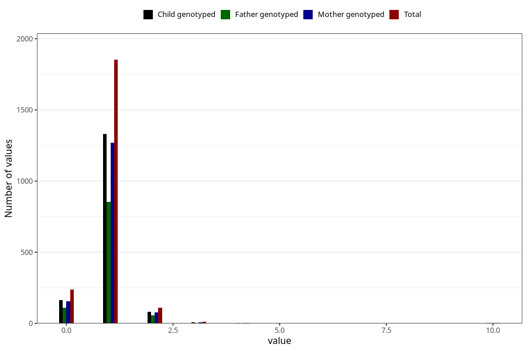

# accident_injury_number_6_11m
Variable mapping to questionnaire: q5, question EE266.
- Number of values:

| Value | Total | Child genotyped | Mother genotyped | Father genotyped |
| ----- | ----- | --------------- | ---------------- | ---------------- |
| Missing | 111400 | 73841 | 70250 | 49187 |
| Non-missing | 2223 | 1590 | 1519 | 1031 |
| 0 | 237 | 162 | 156 | 112 |
| 1 | 1852 | 1332 | 1271 | 856 |
| 2 | 110 | 83 | 79 | 55 |
| 3 | 13 | 7 | 7 | 5 |
| 4 | 3 | 2 | 2 | 0 |
| 5 | 2 | 0 | 0 | 0 |
| 6 | 1 | 0 | 0 | 0 |
| 7 | 1 | 1 | 1 | 0 |
| 9 | 1 | 1 | 1 | 1 |
| 10 | 3 | 2 | 2 | 2 |

