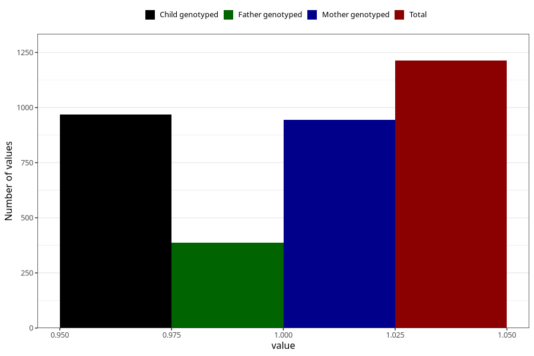

# autistic_traits_no_3y
Variable mapping to questionnaire: q6, question GG101.
- Number of values:

| Value | Total | Child genotyped | Mother genotyped | Father genotyped |
| ----- | ----- | --------------- | ---------------- | ---------------- |
| Missing | 112410 | 74462 | 70825 | 49831 |
| Non-missing | 1213 | 969 | 944 | 387 |
| 1 | 1213 | 969 | 944 | 387 |

