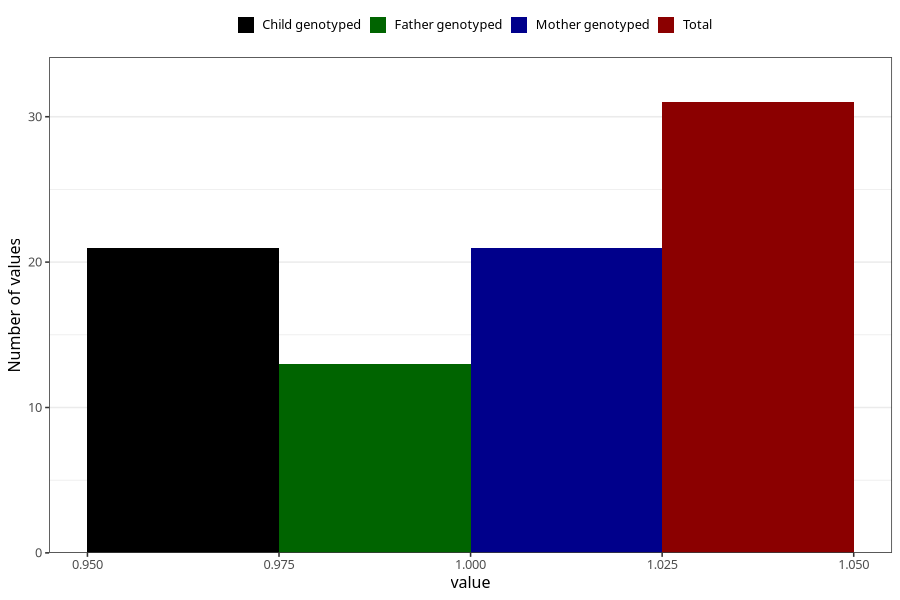

# behavioural_problems_previously_18m
Variable mapping to questionnaire: q5, question EE849.
- Number of values:

| Value | Total | Child genotyped | Mother genotyped | Father genotyped |
| ----- | ----- | --------------- | ---------------- | ---------------- |
| Missing | 113592 | 75410 | 71748 | 50205 |
| Non-missing | 31 | 21 | 21 | 13 |
| 1 | 31 | 21 | 21 | 13 |

