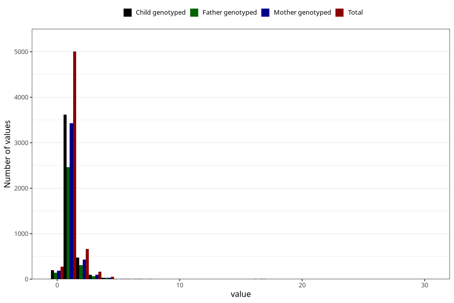

# bronchitis_rs_pneumonia_number_12_18m
Variable mapping to questionnaire: q5, question EE238.
- Number of values:

| Value | Total | Child genotyped | Mother genotyped | Father genotyped |
| ----- | ----- | --------------- | ---------------- | ---------------- |
| Missing | 107411 | 70974 | 67544 | 47195 |
| Non-missing | 6212 | 4457 | 4225 | 3023 |
| 0 | 274 | 196 | 189 | 141 |
| 1 | 5003 | 3613 | 3429 | 2460 |
| 2 | 664 | 471 | 436 | 309 |
| 3 | 165 | 104 | 103 | 69 |
| 4 | 52 | 37 | 35 | 27 |
| 5 | 12 | 10 | 10 | 4 |
| 6 | 11 | 6 | 6 | 3 |
| 7 | 9 | 5 | 4 | 3 |
| 8 | 1 | 0 | 0 | 0 |
| 9 | 1 | 1 | 1 | 1 |
| 10 | 4 | 2 | 2 | 1 |
| 12 | 2 | 0 | 0 | 0 |
| 14 | 4 | 2 | 2 | 1 |
| 16 | 1 | 1 | 1 | 0 |
| 17 | 6 | 6 | 5 | 2 |
| 18 | 2 | 2 | 1 | 1 |
| 30 | 1 | 1 | 1 | 1 |

