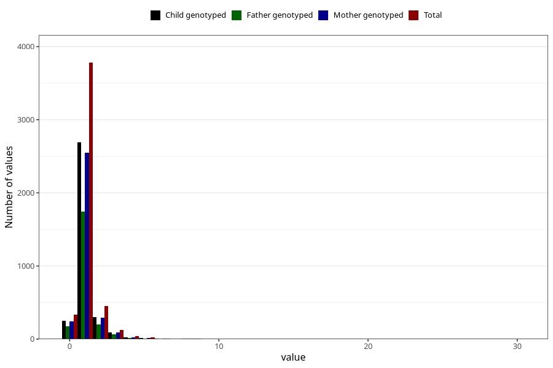

# bronchitis_rs_pneumonia_number_6_11m
Variable mapping to questionnaire: q5, question EE236.
- Number of values:

| Value | Total | Child genotyped | Mother genotyped | Father genotyped |
| ----- | ----- | --------------- | ---------------- | ---------------- |
| Missing | 108844 | 72030 | 68541 | 48000 |
| Non-missing | 4779 | 3401 | 3228 | 2218 |
| 0 | 336 | 249 | 239 | 176 |
| 1 | 3780 | 2689 | 2548 | 1740 |
| 2 | 449 | 303 | 289 | 202 |
| 3 | 124 | 93 | 87 | 64 |
| 4 | 37 | 28 | 27 | 15 |
| 5 | 26 | 17 | 17 | 11 |
| 6 | 10 | 7 | 6 | 2 |
| 7 | 4 | 3 | 3 | 0 |
| 8 | 5 | 5 | 5 | 4 |
| 9 | 1 | 0 | 0 | 0 |
| 10 | 3 | 3 | 3 | 1 |
| 11 | 3 | 3 | 3 | 2 |
| 30 | 1 | 1 | 1 | 1 |

