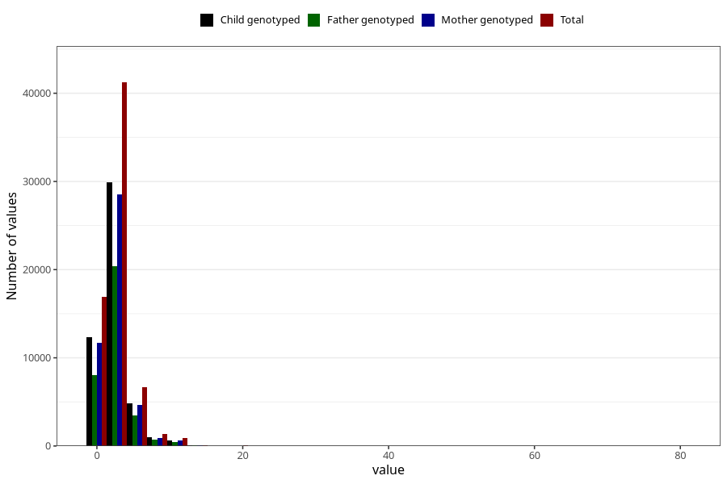

# common_cold_number_12_18m
Variable mapping to questionnaire: q5, question EE218.
- Number of values:

| Value | Total | Child genotyped | Mother genotyped | Father genotyped |
| ----- | ----- | --------------- | ---------------- | ---------------- |
| Missing | 46316 | 26598 | 25263 | 17163 |
| Non-missing | 67307 | 48833 | 46506 | 33055 |
| Filled in text or mark instead of number | 10 | 6 | 5 |6 |
| 25th percentile | 1 | 1 | 1 | 2 |
| 50th percentile | 2 | 2 | 2 | 2 |
| 75th percentile | 3 | 3 | 3 | 4 |

