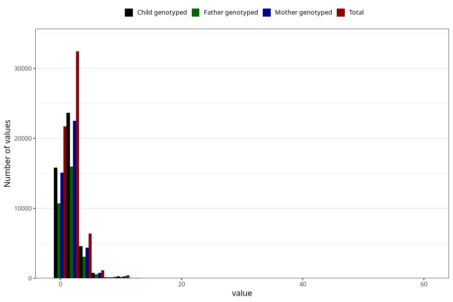

# common_cold_number_6_11m
Variable mapping to questionnaire: q5, question EE216.
- Number of values:

| Value | Total | Child genotyped | Mother genotyped | Father genotyped |
| ----- | ----- | --------------- | ---------------- | ---------------- |
| Missing | 51194 | 30044 | 28570 | 19558 |
| Non-missing | 62429 | 45387 | 43199 | 30660 |
| Filled in text or mark instead of number | 11 | 8 | 7 |6 |
| 25th percentile | 1 | 1 | 1 | 1 |
| 50th percentile | 2 | 2 | 2 | 2 |
| 75th percentile | 3 | 3 | 3 | 3 |

