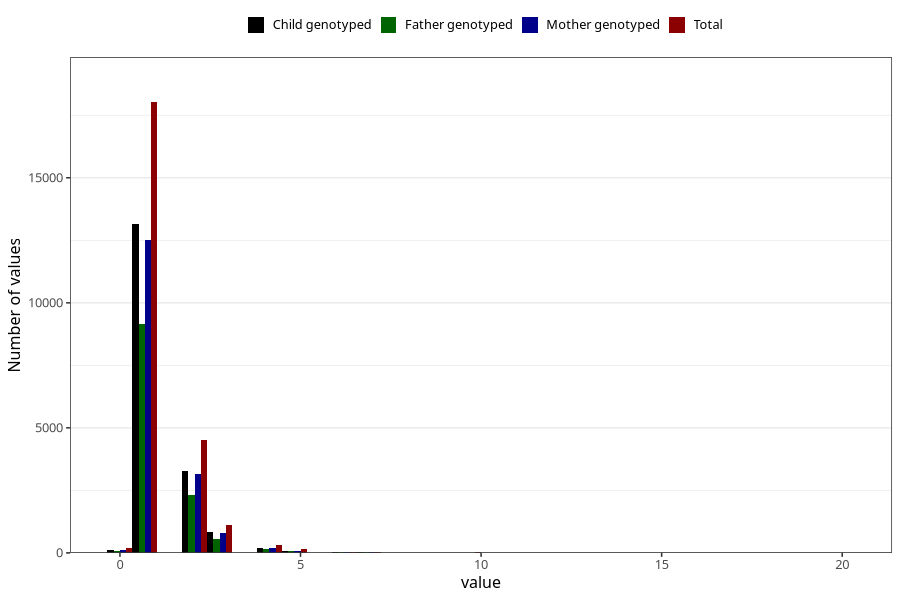

# conjunctivitis_number_12_18m
Variable mapping to questionnaire: q5, question EE253.
- Number of values:

| Value | Total | Child genotyped | Mother genotyped | Father genotyped |
| ----- | ----- | --------------- | ---------------- | ---------------- |
| Missing | 89207 | 57618 | 54795 | 37803 |
| Non-missing | 24416 | 17813 | 16974 | 12415 |
| Filled in text or mark instead of number | 1 | 1 | 1 |0 |
| 25th percentile | 1 | 1 | 1 | 1 |
| 50th percentile | 1 | 1 | 1 | 1 |
| 75th percentile | 2 | 2 | 2 | 2 |

