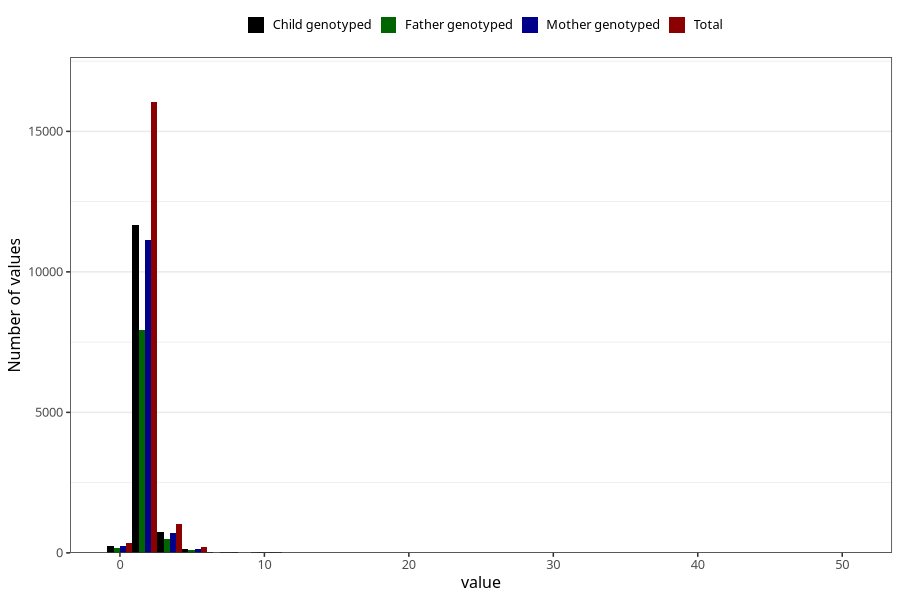

# conjunctivitis_number_6_11m
Variable mapping to questionnaire: q5, question EE251.
- Number of values:

| Value | Total | Child genotyped | Mother genotyped | Father genotyped |
| ----- | ----- | --------------- | ---------------- | ---------------- |
| Missing | 95925 | 62540 | 59474 | 41478 |
| Non-missing | 17698 | 12891 | 12295 | 8740 |
| Filled in text or mark instead of number | 5 | 2 | 2 |1 |
| 0 | 344 | 257 | 248 | 180 |
| 1 | 13029 | 9503 | 9057 | 6452 |
| 2 | 3009 | 2174 | 2074 | 1478 |
| 3 | 767 | 579 | 553 | 369 |
| 4 | 249 | 172 | 168 | 122 |
| 5 | 134 | 93 | 88 | 64 |
| 6 | 60 | 42 | 40 | 28 |
| 7 | 26 | 15 | 15 | 12 |
| 8 | 16 | 11 | 10 | 7 |
| 9 | 3 | 3 | 3 | 2 |
| 10 | 33 | 22 | 22 | 14 |
| 11 | 11 | 10 | 8 | 7 |
| 12 | 5 | 3 | 3 | 2 |
| 14 | 1 | 1 | 0 | 1 |
| 15 | 1 | 1 | 1 | 0 |
| 20 | 2 | 1 | 1 | 0 |
| 25 | 1 | 1 | 1 | 0 |
| 30 | 1 | 1 | 1 | 1 |
| 50 | 1 | 0 | 0 | 0 |

