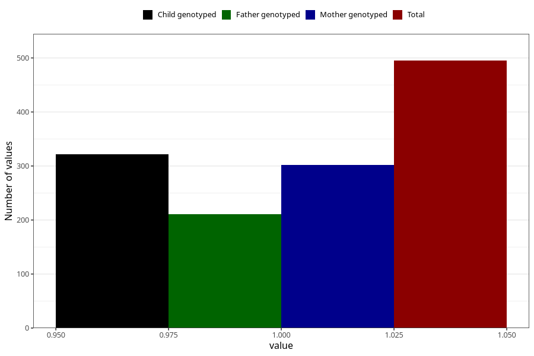

# delayed_psychomotor_development_past_8y
Variable mapping to questionnaire: q9, question NN38.
- Number of values:

| Value | Total | Child genotyped | Mother genotyped | Father genotyped |
| ----- | ----- | --------------- | ---------------- | ---------------- |
| Missing | 113128 | 75109 | 71467 | 50007 |
| Non-missing | 495 | 322 | 302 | 211 |
| 1 | 495 | 322 | 302 | 211 |

