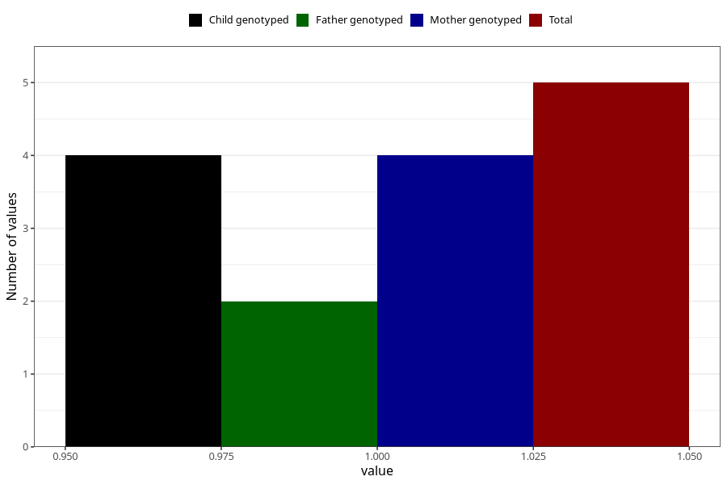

# diabetes_previous_3y
Variable mapping to questionnaire: q6, question GG51.
- Number of values:

| Value | Total | Child genotyped | Mother genotyped | Father genotyped |
| ----- | ----- | --------------- | ---------------- | ---------------- |
| Missing | 113618 | 75427 | 71765 | 50216 |
| Non-missing | 5 | 4 | 4 | 2 |
| 1 | 5 | 4 | 4 | 2 |

